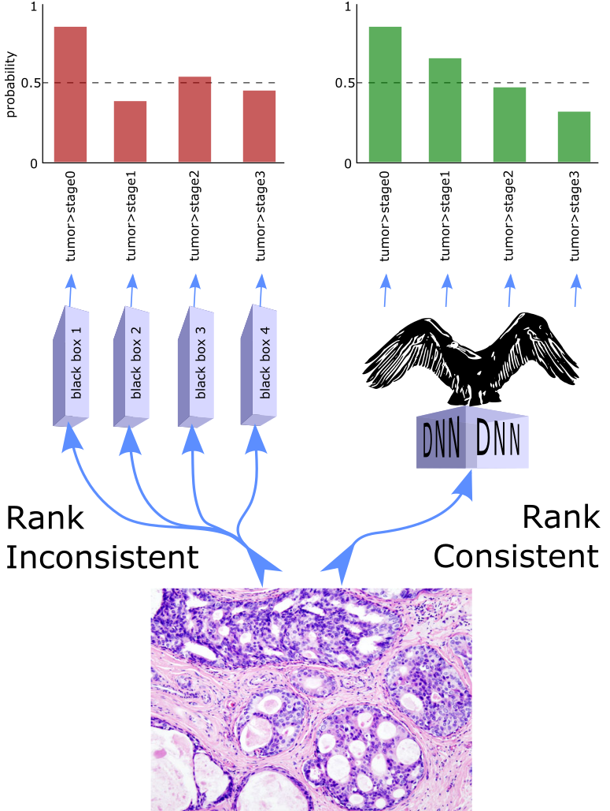

**CORAL implementation for ordinal regression with deep neural networks.**

[](https://pypi.org/project/condor_pytorch/)
[](https://github.com/raschka-research-group/condor_pytorch/blob/main/LICENSE)


<br>

---

## About  
CONDOR, short for CONDitionals for Ordinal Regression, is a method for ordinal regression with deep neural networks,
which addresses the rank inconsistency issue of other ordinal regression frameworks.

It is compatible with any state-of-the-art deep neural network architecture, requiring only modification of the
output layer, the labels, the loss function.

This repository implements the CONDOR functionality (neural network layer, loss function, and dataset utilities) for convenient use.

We also have [CONDOR implemented for Tensorflow](https://github.com/GarrettJenkinson/condor_tensorflow).



---

## Docker

We provide Dockerfile's to help get up and started quickly with `condor_pytorch`.
The cpu image can be built and ran as follows, with tutorial jupyter notebooks
built in.

```bash
# Create a docker image, only done once
docker build -t cpu_pytorch -f cpu.Dockerfile ./

# run image to serve a jupyter notebook
docker run -it -p 8888:8888 --rm cpu_pytorch

# how to run bash inside container (with python that will have deps)
docker run -u $(id -u):$(id -g) -it -p 8888:8888 --rm cpu_pytorch bash
```

An NVIDIA based gpu optimized container can be built and run
as follows (without interactive ipynb capabilities).

```bash
# only needs to be built once
docker build -t gpu_pytorch -f gpu.Dockerfile ./

# use the image after building it
docker run -it -p 8888:8888 --rm gpu_pytorch
```

---

## Cite as

If you use CONDOR as part of your workflow in a scientific publication, please consider citing the CONDOR repository with the following DOI:

- TBD publication

```
@article{condor2021,
title = "Universally rank consistent ordinal regression in neural networks",
journal = "TBD",
volume = "TBD",
pages = "TBD",
year = "TBD",
issn = "TBD",
doi = "TBD",
url = "TBD",
author = "Garrett Jenkinson and Kia Khezeli and Gavin Oliver and John Kalantari and Eric Klee",
keywords = "Deep learning, Ordinal regression, neural networks, Machine learning, Biometrics"
}
```

